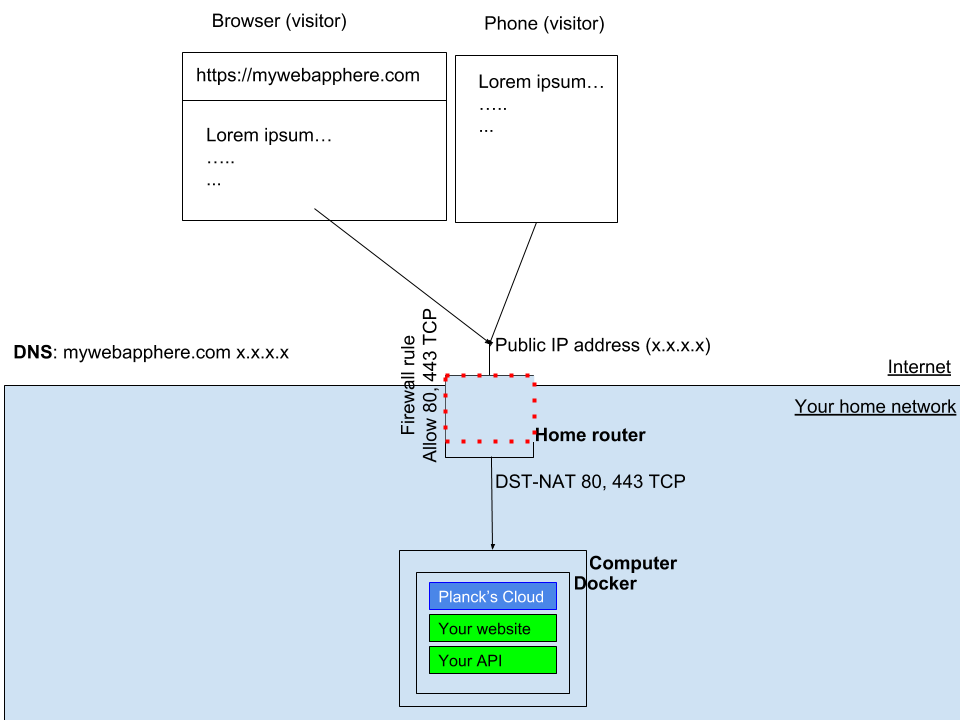

# Planck's Cloud


[](https://microbadger.com/images/planckscloud/plancks-cloud "Get your own version badge on microbadger.com")&nbsp;<a href="https://trello.com/b/NutXeZwS/plancks-roadmap"></a>
<a href="https://coggle.it/diagram/XEgmhoO3UopF8htc/t/logo"></a>&nbsp;[](http://badges.mit-license.org)

# What is Planck's Cloud?

Have you ever wanted to build a tiny app and host it from home? Have you ever had a startup idea and wanted to deploy it within an hour? Planck's Cloud aims to make deploying, reverse proxying and HTTPS your next idea from home a walk in the park.

# How it works

Install Planck's Cloud onto a machine you want to use as a server. Install the CLI and start deploying! 

# What can Planck's Cloud do?

- Host a website from home.
- Host an API available for your next React, Vue or Angular app.
- Run a database for your other services.
- Allows you the freedom, flexibility and control to setup your own cloud infrastructure
- Run your application in a configuration which would allow you to scale out at home or lift and shift to a cloud provider like AWS, GCP, Azure etc.

# Current Status of Planck's Cloud?
&nbsp;<a href="https://codeclimate.com/github/plancks-cloud/plancks-cloud/maintainability"></a>&nbsp;[](https://codebeat.co/projects/github-com-plancks-cloud-plancks-cloud-master)

The features currently available are:
- Create, update and delete docker services.
- Create routes for ingress. Route traffic for a hostname to a service or machine on your network.
- SSL offloading. Expose endpoints with LetEncrypt provided HTTPS.

# Architecture

Planck's Cloud runs is an Open Source Golang app that runs inside a docker container. The standard method of deployment is to run the container as a service inside a docker swarm. Planck's Cloud communicates with the docker daemon to create, update and delete services. Docker also proxies traffic from 80 and 443 on the host to the Planck's Cloud container. Planck's Cloud matches DNS entries to reverse proxy traffic to various services hosted in the swarm or other computers on your network.




# Installation
[](https://hub.docker.com/r/planckscloud/plancks-cloud)
<br />

See <a href="docs/setup.md">the Setup Guide</a> for installation instructions.

# Deploying your first app

## Domain

- Buy a domain with DNS provided (Namecheap, Godaddy etc). You can use one you already own.
- Point a DNS "A record" at your public IP address. To see your public IP open https://ifconfig.co/ in your browser.
- *Optional* Setup your DNS provider's DNS updater to keep up-to-date with your public IP address.

## Deploying a docker container as a service

- Define a service in service.json
```json
{
	"type": "service",
	"list": [
		{
			"id": "my-nginx",
			"name": "nginx",
			"image": "nginx:latest",
			"replicas": 1,
			"memoryLimit": 32
		}		
	]
}
```

- Deploy the service

Run in terminal or cmd `./plancks create -e localhost:6227 -f service.json` (from the folder you created **service.json** in). Replace localhost with the IP address of your server if it's no the machine you're running the cli from.

- Define a route in route.json

Change the domainName field to the domain you would like to use. Change accept to `true` to accept LetsEncrypt terms and automatically setup HTTPS for this route as well.
You may omit the `ssl` portion of the request or set accept to `false`. The email field is provided to LetsEncrypt. Please see their terms regarding the storage and use of your email address.

```json
{
	"type": "route",
	"list": [
		{
			"id": "nginx",
			"domainName": "myheredomin.com",
			"address": "nginx:80",
			"ssl": {
			  "email": "youremailhere@provider.com",
			  "accept": false
			}
		}		
	]
}
```

- Deploy the route

Run in terminal or cmd `./plancks create -e localhost:6227 -f route.json` (from the folder you created **route.json** in). Replace localhost with the IP address of your server if it's no the machine you're running the cli from.

- Test

Use a phone or another device no on your network (connected to the public Internet). Open the domain in your browser.

# Getting Involved

We're dieing to hear what you think about Plancks Cloud, do you like it? do you wish it actually worked? do you want help setting it up? did it help you? or did you want to help us instead?

We're so open to the thoughts and comments, feel free to open an issue on this repository.
